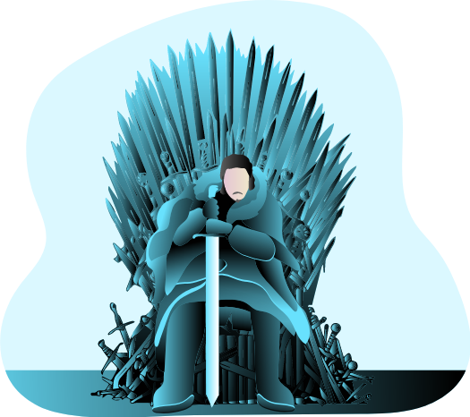

<h1>ManyPixels</h1>

Royalty-free illustrations to power up your projects.

    <Tag>Free</Tag>

Website: <a href="https://www.manypixels.co/gallery/" target="_blank">https://www.manypixels.co/gallery/</a>
<h4 style={{paddingTop:'10px'}}>Examples:</h4>

   

   

   

   

   

   

