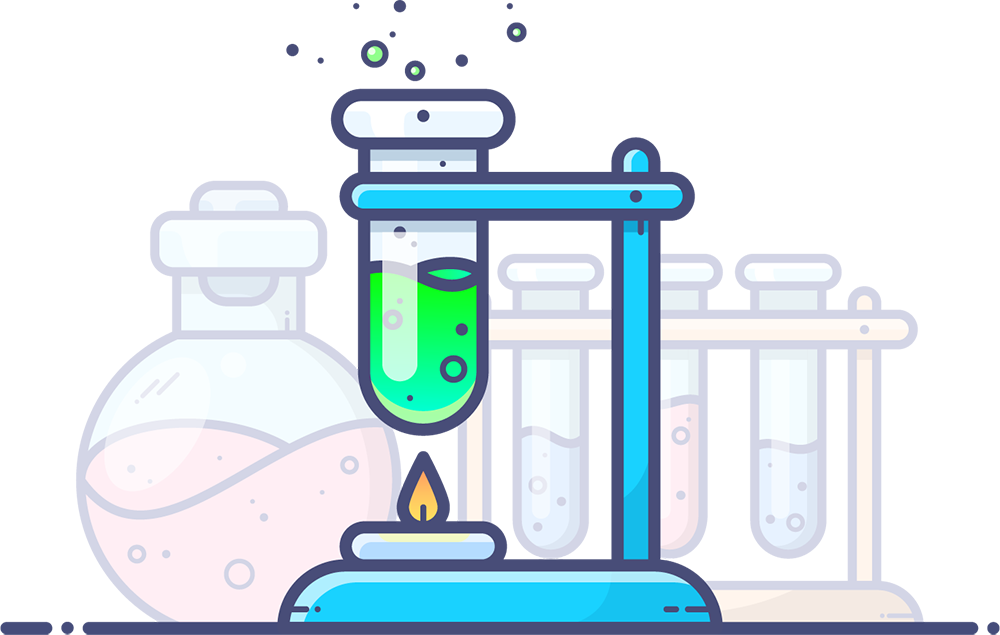
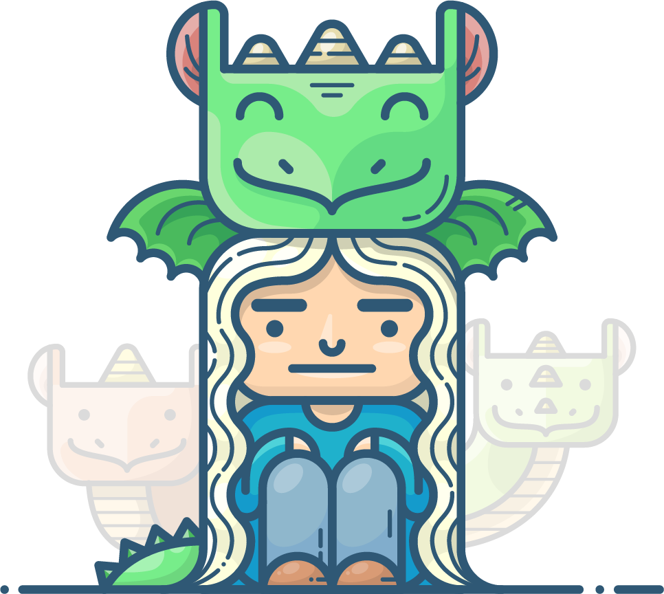
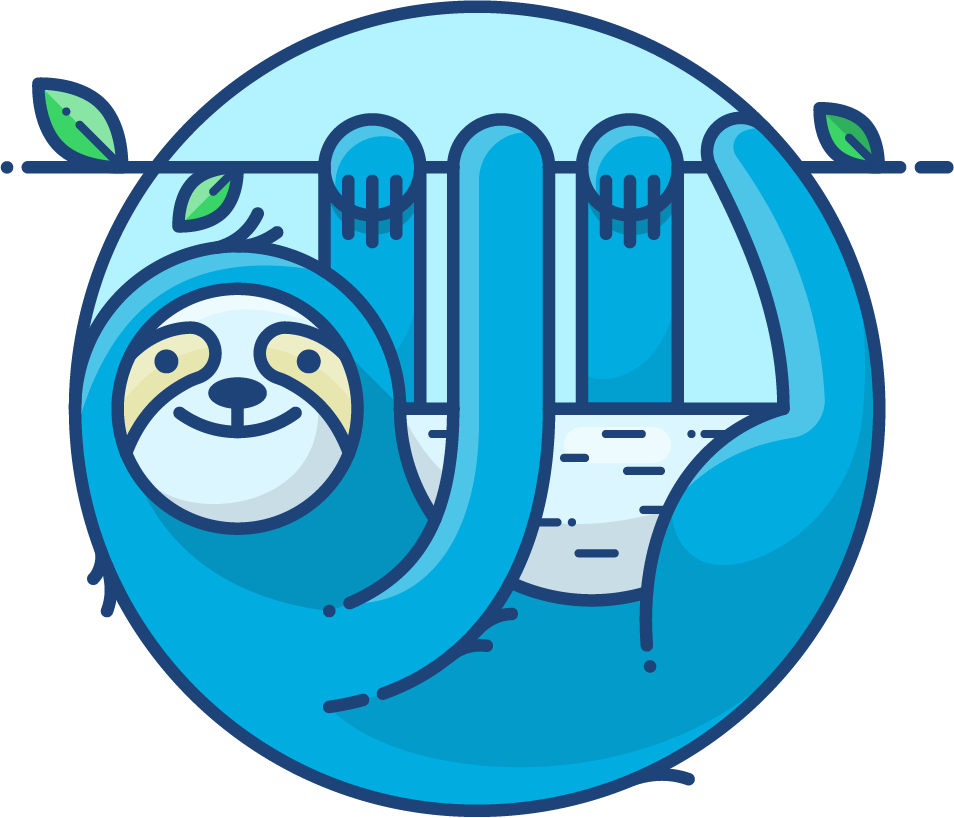

<h1>Outlane</h1>

Free design resources for your personal and commercial projects. Hand-crafted by Outlane..

    <Tag>Free</Tag>
    <Tag>Paid</Tag>

Website: <a href="https://outlane.co/topics/freebie/" target="_blank"> https://outlane.co/topics/freebie/</a>
<h4 style={{paddingTop:'10px'}}>Examples:</h4>

   

   

   

   

   

   

