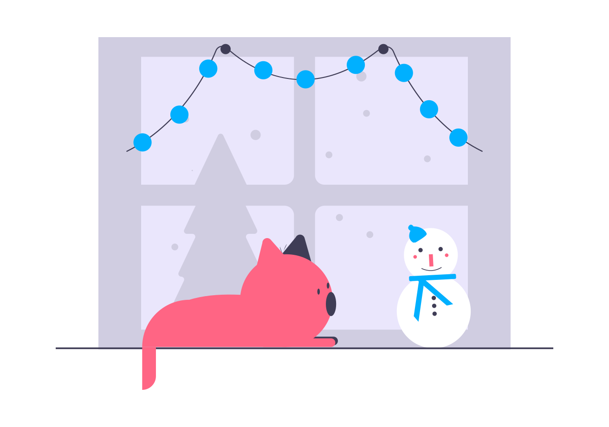

<h1>{props.frontmatter.title}</h1>

{props.frontmatter.description}

    <Tag>OpenSource</Tag>

Website: <a href={props.frontmatter.siteUrl} target="_blank">{props.frontmatter.siteUrl}</a>
<h4 style={{paddingTop:'10px'}}>Examples:</h4>

   

   

   

   

   

   

